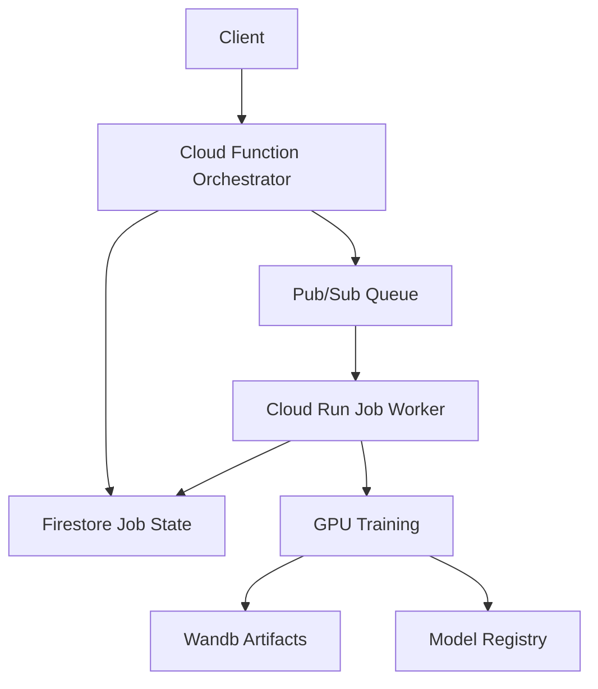

# LaxAI Cloud GPU Training System

A complete, scalable, and cost-efficient system for running long-running GPU training jobs on Google Cloud Platform.

## 🏗️ Architecture Overview



## 🚀 Quick Start

### 1. Prerequisites
```bash
# Set your Google Cloud project
export GOOGLE_CLOUD_PROJECT=your-project-id

# Ensure you have the required APIs enabled
gcloud services enable run.googleapis.com pubsub.googleapis.com firestore.googleapis.com
```

### 2. Deploy the System
```bash
# Deploy both main app and training worker
./deploy.sh

# Or deploy individually
./deploy.sh main    # Main application
./deploy.sh worker  # Training worker
```

### 3. Submit a Training Job
```bash
# Using the Python client
python src/cloud/client.py --url https://your-function-url --action demo

# Or via curl
curl -X POST https://your-function-url/orchestrate \
  -H 'Content-Type: application/json' \
  -d '{
    "tenant_id": "my-tenant",
    "training_params": {
      "epochs": 10,
      "batch_size": 16,
      "learning_rate": 0.001
    },
    "model_params": {
      "architecture": "yolo"
    },
    "custom_name": "my-training-job"
  }'
```

## 📁 System Components

### Core Infrastructure
- **`src/cloud/firestore_client.py`** - Job state management
- **`src/cloud/function_orchestrator.py`** - Cloud Function for job orchestration
- **`src/cloud/worker.py`** - Cloud Run Job for GPU training execution
- **`src/config/cloud-config.env`** - Centralized configuration

### Deployment & Configuration
- **`cloudbuild.yaml`** - Main application build/deploy
- **`cloudbuild-worker.yaml`** - Training worker build/deploy
- **`deploy.sh`** - Simple deployment script
- **`deploy-worker.sh`** - Detailed worker deployment

### Client Tools
- **`src/cloud/client.py`** - Python client for job submission/monitoring
- **`src/cloud/test_worker.py`** - End-to-end testing utilities

## ⚙️ Configuration

All infrastructure settings are centralized in `src/config/cloud-config.env`:

```bash
# GPU & Resources
export GPU_TYPE="nvidia-l4"
export CPU_LIMIT="4000m"
export MEMORY_LIMIT="16Gi"
export GPU_COUNT="1"

# Infrastructure
export CLOUD_REGION="us-central1"
export SERVICE_ACCOUNT="googlebatch"
export REGISTRY_REPO="laxai-repo"
```

To change GPU type or resources:
1. Edit `src/config/cloud-config.env`
2. Run `./deploy.sh`
3. All services update automatically

## 📊 Monitoring & Logging

### View Training Logs
```bash
# Worker execution logs
gcloud logging read 'resource.type="cloud_run_job"' --limit=50

# Cloud Function logs
gcloud logging read 'resource.type="cloud_function"' --limit=50
```

### Monitor Job Status
```bash
# Python client
python src/cloud/client.py --url YOUR_URL --action status --task-id TASK_ID

# Direct Firestore query
gcloud firestore documents describe projects/$GOOGLE_CLOUD_PROJECT/databases/(default)/documents/training_jobs/TASK_ID
```

### Pub/Sub Queue Status
```bash
# Check subscription backlog
gcloud pubsub subscriptions describe training-jobs-sub

# View pending messages
gcloud pubsub subscriptions pull training-jobs-sub --limit=5
```

## 🔧 Development & Testing

### Local Development
```bash
# Test worker locally
cd src/cloud && python worker.py local

# Test Cloud Function locally
cd src/cloud && python function_orchestrator.py

# Run end-to-end tests
python src/cloud/test_worker.py test
```

### Build Images Locally
```bash
# Main application
docker build -t laxai-main .

# Training worker
docker build -f src/cloud/Dockerfile.worker -t laxai-worker .
```

## 💰 Cost Management

### Auto-scaling Features
- **Cloud Run Jobs**: Scale to zero when no jobs
- **Pub/Sub**: Pay per message, automatic scaling
- **Firestore**: Pay per operation
- **GPU**: Only billed during job execution

### Cost Controls
```bash
# Set maximum concurrent jobs
export MAX_CONCURRENT_JOBS="3"

# Set job timeout (prevents runaway costs)
export TRAINING_TIMEOUT="25200"  # 7 hours max

# Use preemptible GPUs (if available)
# Note: Requires additional configuration
```

### Monitor Costs
```bash
# View current Cloud Run jobs
gcloud run jobs list --region=us-central1

# Check GPU usage
gcloud logging read 'resource.type="cloud_run_job" AND textPayload:"GPU"'
```

## 🚨 Troubleshooting

### Common Issues

**Job Stuck in "queued" Status**
```bash
# Check if worker is running
gcloud run jobs execute laxai-training-worker --region=us-central1

# Check Pub/Sub subscription
gcloud pubsub subscriptions describe training-jobs-sub
```

**GPU Not Available**
```bash
# Verify GPU quota in region
gcloud compute project-info describe --format="value(quotas[].metric:quotas[].limit)" | grep GPU

# Check available GPU types
gcloud compute accelerator-types list --filter="zone:us-central1"
```

**Import Errors in Worker**
```bash
# Check image build logs
gcloud logging read 'resource.type="cloud_build"' --limit=10

# Test imports locally
cd src/cloud && python -c "from firestore_client import get_firestore_client"
```

### Debug Commands
```bash
# Force worker execution
gcloud run jobs execute laxai-training-worker --region=us-central1

# View detailed job logs
gcloud run jobs describe laxai-training-worker --region=us-central1

# Test Firestore connection
python -c "
from google.cloud import firestore
client = firestore.Client()
print('Firestore connected successfully')
"
```

## 🔄 Updating the System

### Deploy New Code
```bash
# Update both services
./deploy.sh

# Update just worker
./deploy.sh worker
```

### Change GPU Type
```bash
# Edit src/config/cloud-config.env
export GPU_TYPE="nvidia-t4"  # or nvidia-v100

# Redeploy
./deploy.sh
```

### Scale Resources
```bash
# Edit src/config/cloud-config.env
export CPU_LIMIT="8000m"
export MEMORY_LIMIT="32Gi"

# Redeploy
./deploy.sh
```

## 📚 API Reference

### Submit Training Job
```http
POST https://your-function-url/orchestrate
Content-Type: application/json

{
  "tenant_id": "string",
  "training_params": {
    "epochs": 10,
    "batch_size": 16,
    "learning_rate": 0.001,
    "model_type": "detection"
  },
  "model_params": {
    "architecture": "yolo",
    "input_size": 640
  },
  "custom_name": "string",
  "wandb_tags": ["tag1", "tag2"]
}
```

### Get Job Status
```http
GET https://your-function-url/status?task_id=uuid
```

### Response Format
```json
{
  "task_id": "uuid",
  "status": "queued|running|completed|failed|cancelled",
  "created_at": "2025-08-25T10:00:00Z",
  "progress": {
    "epoch": 5,
    "total_epochs": 10,
    "progress_percent": 50,
    "message": "Training epoch 5/10"
  }
}
```

## 🛡️ Security & Permissions

### Required IAM Roles
- Cloud Run Developer
- Pub/Sub Editor  
- Firestore User
- Cloud Functions Developer
- Artifact Registry Writer

### Service Account Permissions
The `googlebatch` service account needs:
- `pubsub.subscriber`
- `datastore.user`
- `logging.logWriter`
- `storage.objectAdmin`

## 🎯 Best Practices

### Job Design
- Keep training jobs idempotent
- Save checkpoints frequently
- Use meaningful job names
- Include comprehensive logging

### Resource Management
- Monitor GPU quotas
- Set appropriate timeouts
- Use cost alerts
- Clean up completed jobs

### Development Workflow
1. Test locally first
2. Use staging environment
3. Monitor logs during deployment
4. Validate with end-to-end tests

---

## 🎉 You're All Set!

Your LaxAI cloud GPU training system is now ready for production workloads. The system provides:

✅ **Scalable GPU training** with automatic resource management  
✅ **Cost-efficient** pay-per-use model with auto-scaling  
✅ **Reliable** job state management and error handling  
✅ **Easy to use** Python client and REST API  
✅ **Production-ready** monitoring and logging  

Happy training! 🚀
